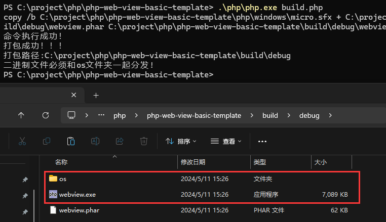
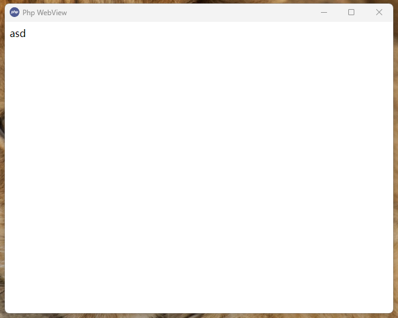

# php-webview

> php版本目录文件可能会报毒，请放心使用(因为经过压缩实现打包后打底仅仅 7M 的体积)

```
目录结构
.
├── library\          库目录(制作PHP可调用拓展)
|
├── os\               系统拓展目录
|   
├── php\              php环境目录
|   
├── src\              应用目录
|   └── index.php     入口文件(文件名别修改)
|
├── favicon.ico       文件图标
|
└── windows.bat       windows运行文件
```

## 更新
**进入src目录**

windows用户

运行命令 `..\php\php.exe ..\php\composer.phar update` 更新

自己php环境 `php composer update` 更新

### 运行
**进入根目录**

windows用户

双击 `windows.bat` 或者运行命令 `.\php\php.exe src/index.php` 启动

自己php环境 `php src/index.php` 启动 (必须开启ffi拓展和phar拓展)

### 打包
**进入根目录**

运行命令 `.\php\php.exe build.php` 或者自己php环境运行 `php build.php`



编译后仅仅7M打底

### 效果


#### 文件图标
**提示** 文件图标必须在启动目录下，不然不显示

## 构建
有关先决条件，请阅读 [The link](https://github.com/webview/webview#prerequisites)

要构建库，请运行 **library/build.sh** 在unix系统上， **library/build.bat** 在 Windows

# 教程

配置

```php

use KingBes\PhpWebview\WebView;
use KingBes\PhpWebview\WindowSizeHint;

/**
 * @param string $title 窗口标题
 * @param int $width 窗口宽度
 * @param int $height 窗口高度
 * @param bool $debug debug模式 默认：false
 * __DIR__ 入口位置
 */
$webview = new WebView('Php WebView', 640, 480, true, __DIR__);
```

获取与设置

```php
// 获取ffi          返回：FFI
$webview->getFFI();
// 获取webview      返回：mixed
$webview->getWebview();
// 获取窗口标题     返回：string
$webview->getTitle();
// 设置窗口标题     参数：title=string
$webview->setTitle(title:"新的标题");
// 获取窗口宽度     返回：int
$webview->getWidth();
// 设置窗口宽度     参数：width=int
$webview->setWidth(width:100);
// 获取窗口高度     返回：int
$webview->getHeight();
// 设置窗口高度     参数：height=int
$webview->setHeight(height:100);
// 获取窗口大小提示  返回：int
$webview->getHint();
// 设置窗口大小提示  参数：hint=WindowSizeHint::HINT_MIN
$webview->setHint(hint:WindowSizeHint::HINT_MIN);
// 修改窗口大小  参数 width=int height=int hint=WindowSizeHint ：HINT_NONE 自由缩放 HINT_MIN 固定最小 HINT_MAX 固定最大 HINT_FIXED 禁止缩放
$webview->size(int $width, int $height, WindowSizeHint $hint);
// 判断是否debug    返回：bool
$webview->isDebug();
// 设置html内容     参数：html=string
$webview->setHTML(html:"<a>html的内容</a>");
// 绑定交互的操作    参数：name=string ，闭包函数：$req 是接收到的参数,$seq 是触发次数
$webview->bind(name:"bindName",function($seq, $req, $context){
    return ["返回内容","返回数组"];
});
// 解除绑定         参数：name=你绑定过的name名
$webview->unbind(name:"bindName");
// 设置窗口url内容  参数：url=string
$webview->navigate(url:"http://www.baidu.com");
// 运行
$webview->run();
// 销毁
$webview->destroy();
```

## 示例一 `js和php交互`

```php

require_once "vendor/autoload.php";

use KingBes\PhpWebview\WebView;

// 实例
$webview = new WebView('Php WebView', 640, 480, true, __DIR__);

$html = <<<EOF
<button onclick="onBtn()">点击</button>
<script>
    function onBtn(){
        let msg = "hello php"
        btn(msg).then(function (data) {
            alert(data)
        })
    }
</script>

EOF;

// 设置HTML
$webview->setHTML($html);
// 绑定
$webview->bind('btn', function ($seq, $req, $context) {
    return $req;
});
// 运行
$webview->run();
// 销毁
$webview->destroy();

```

## 示例二 `设置本地静态文件`

```php
require_once "vendor/autoload.php";

use KingBes\PhpWebview\WebView;

// 实例
$webview = new WebView('Php WebView', 640, 480, true, __DIR__);
// 本地文件`index.html`
$navigate = "file://D:\xxx\index.html";
// 设置url
$webview->navigate($navigate);
// 运行
$webview->run();
// 销毁
$webview->destroy();

```