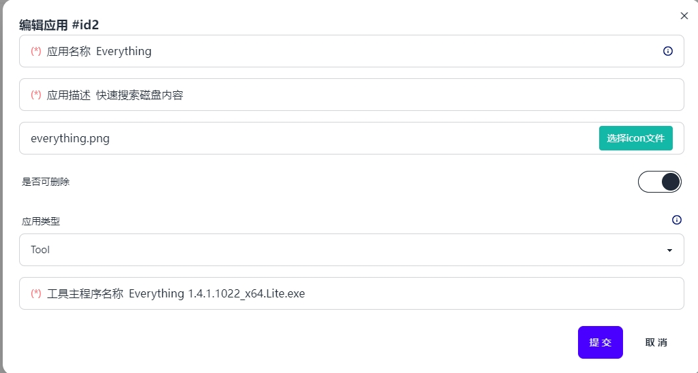
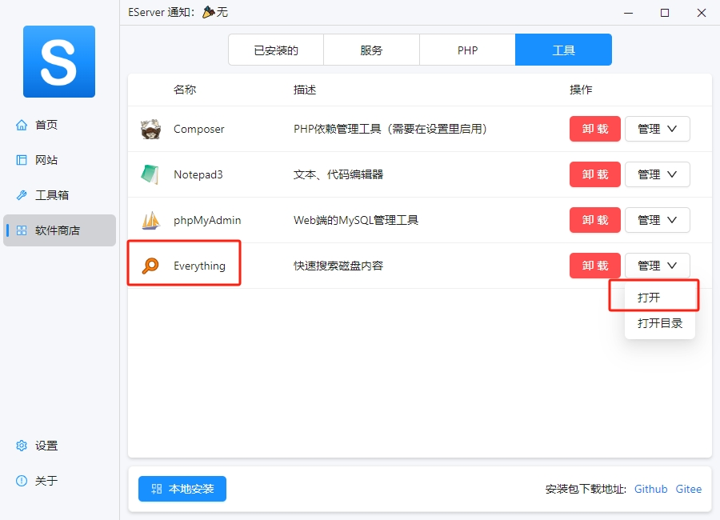
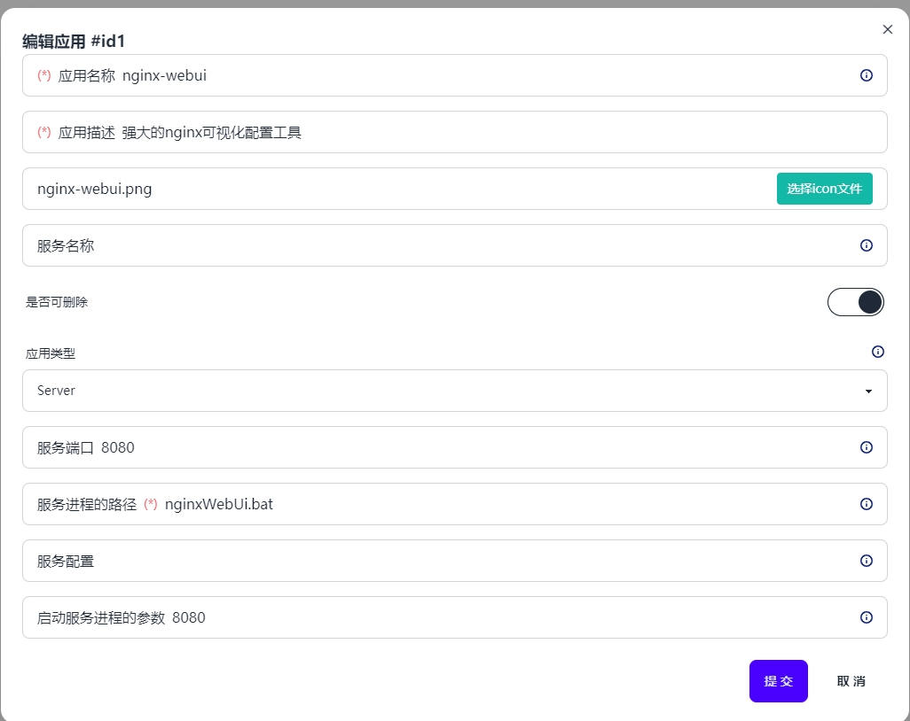
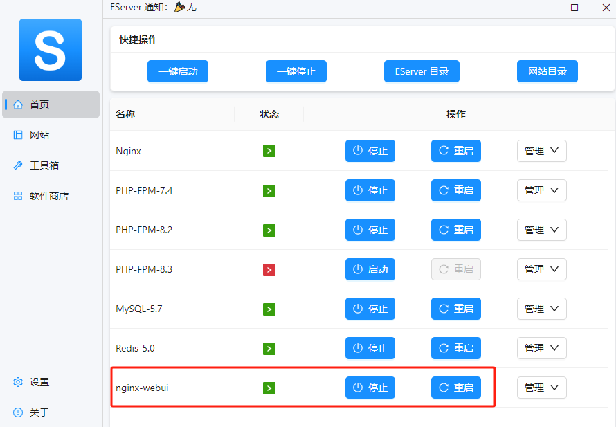
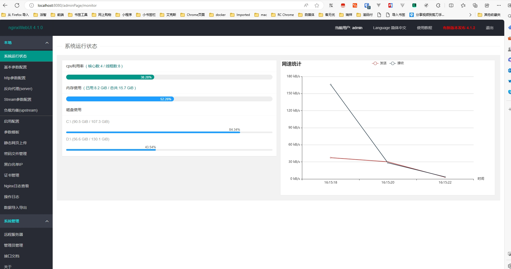

# eserver-tool

## eserver 下载
https://www.phpenv.cn/download.html

## 使用

### 启动

cd src && ..\php\php.exe .\index.php


### 浏览eserver 根目录

 

### 新增编辑

#### 新增工具

 
将example里的 `Everything` 放入到自己eserver 的 `core\software\tool\`下，将everything.png 放入

`core\config\software\icon` 下 点击新增，按照图上的填写提交后 重启软件，就能在工具栏里看到了。
效果如下图



### 注意
目前只支持win，mac下配置文件结构不一样，用的比较少。

服务端口只是用于监听进程是否启动，在服务器参数里传入端口 ${ServerPort} 是无效的，请填写具体的数值 如8081

通过bat 启动 java 应用或其他程序 兼容不传端口和传入端口参数的写法

#### 新增服务
服务一般都是带端口限制的进程如web网站等。

举一个 nginx-webui 项目的例子

下载 https://gitee.com/link?target=http%3A%2F%2Ffile.nginxwebui.cn%2FnginxWebUI-4.1.2.jar
放入 `core\software\server\` nginx-webui 目录（没有手动建一个）下

将example\nginx-webui下的 nginx-webui.png 图标放到 `core\config\software\icon`下
参考官方 gitee 里的文档 知道 win下启动命令行为

``` bash
java -jar -Dfile.encoding=UTF-8 D:/home/nginxWebUI/nginxWebUI.jar --server.port=8080 --project.home=D:/home/nginxWebUI/
```
然后新建下面的bat为 nginxWebUi.bat 

~~~ bat
chcp 65001

@echo off & setlocal
rem echo arg0=%0
rem echo arg1=%1
rem echo arg1 no quotes=%~1
rem echo batfile fullpath=%~f0
rem echo batfile=%~n0
rem echo batfolder=%~dp0

rem set var2="var2"
if "%~1"=="" ( 
    echo arg1 undefined
    set port=8080
) else ( 
    echo arg1 is passed, the value is: %~1
    set port=%~1
)
 

java -jar -Dfile.encoding=UTF-8 %~dp0nginxWebUI-4.1.2.jar --server.port=%port% --project.home=%~dp0

rem return code demo
exit /b %1
~~~

按照下图去新增

重启eserver。启动 nginx-webui，

浏览器输入 `localhost:8080`

搞定。


默认8080端口 如果 `xxx.bat 8081` 择端口被作为arg1 传入了。 arg0 是bat的路径

应用类型为Server 时

`ShellServerProcess` 为 true 自动隐藏终端 false 显示cmd 命令行方便调试

默认生成的配置为了美观不误关闭进程默认是true。

`%~dp0` 表示脚本所在的当前目录，所以下次你想运行什么java 或者其他 exe 应用时 只需参照官方运行命令
将目录修改为 `%~dp0\xxx.jar`  或 `%~dp0\xxx.exe` 就行了。配置端口参数，如果有更多参数就  arg2 arg3 仿照去定义默认值就行。

